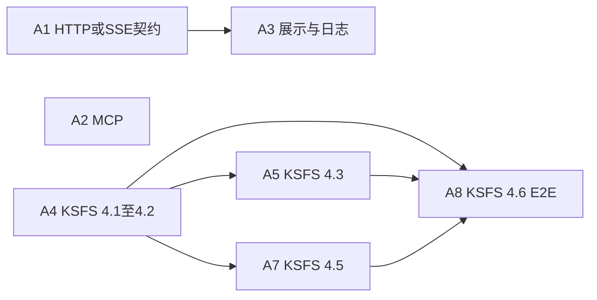

# Logos — 下一阶段开发计划（草案）

> **地位**：承接 V0.1 归档与 KSFS 子系统定案之后的工作队列；与 **`重要子系统开发文档/KSFS开发.md`**、**`ARCHITECTURE.md`** 冲突时以二者为准，本文件仅作**排期与目标**备忘。  
> **更新**：随迭代增删，不必等版本号冻结。

**产品形态（与 `DECISIONS.md` 第 10 节对齐）**：按 **独立工作助手** 方向开发；GUI **优先侧边栏式**交互，**命令面板式**可放缓或简化。壳层为 **独立桌面窗口**，**Electron** 已定（见 `DECISIONS.md` 第 10 节），不改变下列后端主队列优先级。

**本阶段范围（2026-05-12 定案）**：**不实现「设定导入」全链**（含 MCP 设定导入 Skill、按 `entity_template` 自动写 `workspace/setting_entry/`、与导入强绑定的重叠检测产品化等）。讨论结论与 MVP 契约封存于 **`重要子系统开发文档/设定导入Skill开发.md`**。**当前重心**：**KSFS/HDL 本体**（HSI 发号与登记、SVS chunk、晋升端口/CLI、E2E 装配）及下列 **HTTP / MCP 基础 / 展示日志** 队列；下文任务块 **不含 A6**。

---

## 0. 本文件怎么用（复制粘贴发任务）

- 下文 **「任务块」** 为 **A1～A5、A7、A8**（**无 A6**）；整段复制即可发给执行者；按需改分支名、截止日、指派人。
- **依赖关系**见「多 Agent 并行轨」与文末 mermaid；**合并顺序**见 **§5**；**个人多会话怎么并行**见 **§12**。
- **已定案**见 **§1.2**、**§5** 开头。

---

## 1. 协作释义（HTTP / SSE / GUI / MCP）

### 1.1 「MCP + HTTP 并行时注意：契约变更需同步 GUI 与文档」指什么？

- **HTTP 契约**这里主要指：**REST 路径与请求体/响应体**、以及 **SSE 流里的事件类型名（event）与每条事件的 JSON 字段**（例如 `reasoning_delta`）。GUI 要解析 SSE、调 bootstrap 等，**与后端共用同一套约定**。
- **MCP**走的是另一路（如 stdio 上的 JSON-RPC），**不替代** HTTP/SSE；但若某能力「既暴露为 MCP 工具、又在 HTTP 里出现同名概念或重复配置」，改名或改字段时容易只改一端。
- **同步 GUI 与文档**的含义是：任何**对外可见**的契约改动必须 **（1）改 `API-V0.1.md` 或 `API-V0.2.md` 等权威文档（2）改后端实现（3）改 GUI 解析/类型** 在同一里程碑内完成，并尽量用**契约测试/单测**锁住，避免出现「后端已发新事件名、文档未写、GUI 仍按旧字段解析」的三方漂移。

### 1.2 契约策略：已定案与备选对照

**已定案（2026-05-12）**

- **先合 A1 入基线**：HTTP/SSE 契约 + 文档 + 测试在一个 PR **先合并进主分支**（`main` 或团队约定主分支），再开展强依赖 GUI 的改动（如 A3）。
- **临时集成分支**：各 feat 先合入 **`integrate/next-phase`**（名称可改，本文以此为准），在集成分支上完成 **§7 阶段最终验收**；**验收无误后**，再将集成分支 **合并回主分支**（一次性或按约定批次；merge / squash 由团队习惯决定）。

以下为当时对比用的**备选说明**（未选为默认流程，仅作记录）。

| 策略 | 做法 | 优点 | 代价 / 风险 |
|------|------|------|-------------|
| **先合入基线**（**已选为 A1 路径**） | 契约 + 测试 + 文档在一个 PR 先合并进 `main`，GUI/展示轨再基于该 commit 开发 | 单一真相在版本树里，**冲突少、可回滚**；后续 PR 差异清晰 | GUI 若开工早，可能在合入前需 **rebase 或短暂停工** |
| **先冻结字段表**（未选为默认） | 不立刻合代码，但在文档或表格中 **锁定事件名 + 最小 JSON 字段**，各轨按表并行实现 | **并行度最高**；GUI 可先写类型与 mock | 若实现中发现表不合理，**改表 = 多方返工**；需有人维护「冻结表」变更日志 |

### 1.3 MCP 会「规范化」引入 skill，那怎么会改变 REST/SSE？

- **协议层面**：MCP 与 **REST/SSE 是正交的**。MCP 是 Agent 与工具宿主之间的 **JSON-RPC（常见为 stdio）** 能力发现/调用协议；REST/SSE 是 **GUI 与后端** 的 HTTP 契约。**引入 MCP 本身不会改写 SSE 事件名或 REST 路径。**
- **文档里仍写「并行时注意」的原因**：风险在**工程与产品边界**，不在 MCP 规范本身。例如：（1）同一功能 **既** 暴露为 MCP 工具 **又** 通过 HTTP 辅助接口暴露，改名时只改一端；（2）**共享配置键、环境变量、进程模型** 的改动波及 GUI 启动与后端 bootstrap；（3）代码重构时把原 HTTP 层逻辑迁到 MCP 子进程而未同步文档。  
- **结论**：默认 **不要求**「MCP 改 REST 必须二次 Review」这类规则；若某 PR **显式修改** `api_v1`、SSE 类型或 OpenAPI/文档中的 HTTP 契约，则仍走 **§1.1** 的三方同步与契约负责人审阅。

---

## 2. 目标队列（与实现深度对齐）

### 2.1 HTTP 契约与实现对齐

- **目标**：维护 **`重要子系统开发文档/API-V0.2.md`**（现行权威），使 **SSE 事件表**与后端/GUI **一致**；`API-V0.1.md` 为归档对照。
- **验收**：单测或契约测试覆盖事件名与最小 JSON 字段；GUI 与文档同源。

### 2.2 MCP 能力层（完整协议）

- **目标**：本地 **MCP Server**（JSON-RPC over stdio 或选定传输）、**至少一个可测 skill** 经 MCP 接入 Agent；**渐进式披露**（列表 vs 按需详情）与 **`GuardedToolRegistry` / 沙箱** 对齐。**本阶段不要求**交付「设定导入」专用 Skill（该方向已封存，见 **`重要子系统开发文档/设定导入Skill开发.md`**）；示例仍以 `skills/example-stdio-mcp` 为参照即可。
- **验收**：集成测试起停子进程无僵尸；工具 schema 与内置 JSON 工具尽量同源。

### 2.3 展示与日志（`SPEC-DISPLAY-AND-LOGGING-V0.1.md`）

- **目标**：`ui.default_presentation`、`obs.log_profile`（或等价）、可选 **`GET /api/v1/bootstrap`**；SSE 分事件承载 WM / 开发者档位（与 DECISIONS 一致）。
- **验收**：配置与 GUI 会话行为符合该补充规格中的正交原则。

### 2.4 KSFS / HDL 实现深化（本阶段排期）

| 序号 | 项 | 说明 |
|------|----|------|
| 4.1 | **HSI 发号与回写 `id`** | SQLite 分配、`id:` 写回 front matter、§3.4 与稿中 `id` 冲突规则 |
| 4.2 | **自动登记钩子** | 进程启动或首次检索前执行一次（§3.2），与 FastAPI lifespan / Retrieval 懒加载落地 |
| 4.3 | **SVS chunk + chunk_id** | 按 `KSFS开发.md` §5、`chunk_id` §5.5；增量更新 Chroma |
| 4.5 | **草稿晋升 CLI** | `DraftPromotionPort` + mtime 校验（§3.2 / §7）；**通用** workspace→`ksfs_root` 晋升，本阶段**不依赖**设定导入 Skill |
| 4.6 | **端到端启动** | `run_backend_stub` 或新入口装配真实 `FusedRetrievalService` + 登记流程 |

### 2.5 封存 — 设定导入（本阶段不做）

- **规格与讨论结论**：**[`设定导入Skill开发.md`](重要子系统开发文档/设定导入Skill开发.md)**（含 Skill/HDL 分层、`setting_entry`、`entity_template/default_import_v0` 索引、重叠检测与 SVS 触发等备忘）。  
- **`KSFS开发.md` §7.3**、**`DECISIONS.md` §12** 仍为产品语义权威；**实现**延后至恢复排期后，从封存文档接续。

---

## 3. 依赖与风险

- **多格式**：**不**作为 HDL 核心依赖；若做 **可选 `.docx` Skill**，在能力层单独引入 `python-docx`（或等价）并审许可证（见 `DECISIONS.md` §12）。
- **MCP + HTTP**：并行时遵守 **§1.1**；契约变更走同一里程碑内的 **文档 + 后端 + GUI** 同步。

---

## 4. 多 Agent 并行轨（分工一览）

| 代号 | 范围 | 建议分支名（可改） | 依赖 |
|------|------|-------------------|------|
| **A1** | §2.1 HTTP/SSE 契约 + 文档 + 测 | `feat/api-contract-sse` | 无（契约轨优先） |
| **A2** | §2.2 MCP 全协议 + skill + 沙箱对齐 | `feat/mcp-server-guarded` | 尽量不依赖 A1；若与 HTTP 概念交叉则 A1 后合 |
| **A3** | §2.3 展示 / 日志 / bootstrap | `feat/ui-bootstrap-display-log` | **A1 已合并入主分支**（已定案，见 §1.2） |
| **A4** | §2.4 之 4.1 + 4.2 | `feat/ksfs-hsi-id-auto-register` | KSFS 基础，**尽量最先合** |
| **A5** | §2.4 之 4.3 | `feat/ksfs-svs-chunk-chromadb` | A4 |
| **A7** | §2.4 之 4.5 | `feat/ksfs-draft-promotion-cli` | 可与 A4/A5 并行 |
| **A8** | §2.4 之 4.6 E2E 装配 | `feat/ksfs-e2e-fused-retrieval` | A4、A5；A7 视产品需要 |



---

## 5. 分支与合并策略（已定案）

**已定案（2026-05-12）**：**A1 先直达主分支**；其余本阶段改动经 **`integrate/next-phase`** 集成，**阶段验收通过后再整体并回主分支**。

1. **A1（HTTP/SSE 契约）**：PR **合并目标为主分支**（`main` 等），**不经过**集成分支，以尽快固定 GUI 与文档的契约基线。  
2. **集成分支**：在已包含 A1 的 `main` 上拉 **`integrate/next-phase`**（名称可改）。本阶段 **A2、A3、A4、A5、A7、A8** 的 work 先合入该分支；**单人开发**时由你本人维护该分支的 rebase/合并即可，**无需**单独指定「维护者」角色。  
3. **在集成分支上验收**：完成 **§6** 自检并满足 **§7** 后，将 **`integrate/next-phase` 合并回 `main`**（一次 merge 或 squash 均可）。合并后可删集成分支。  
4. **KSFS 依赖顺序**：**A4 → A5 / A7（并行）→ A8**；多分支改同一包时 **先 rebase 再跑全量测试**。  
5. **A3**：合并进 integrate 前确保 **本地 `main` 已含 A1**（或 integrate 已 rebase 过含 A1 的 main）。

**每个 PR / 合并门槛（自审）**：`pytest` 等与 CI 一致；无 MCP 子进程僵尸；改 HTTP/SSE 时在 commit/PR 说明里写清 **契约变更摘要**（见 **§1.1、§1.3**）。

---

## 6. 分轨验收（执行者自检）

| 代号 | 验收要点 |
|------|-----------|
| A1 | SSE 事件名与最小 JSON 有测；`API-V0.1`/`V0.2` 与后端一致 |
| A2 | 集成测起停 MCP；schema 与内置工具尽量同源；沙箱/registry 行为符合设计 |
| A3 | 配置与 `SPEC-DISPLAY-AND-LOGGING-V0.1.md` 正交原则一致；SSE 档位与 DECISIONS 一致 |
| A4 | 发号、回写 `id:`、导入冲突、登记钩子时机可测 |
| A5 | `chunk_id` 与 Chroma 增量符合 `KSFS开发.md` §5 / §5.5 |
| A7 | CLI 走 `DraftPromotionPort`；mtime 校验符合 §3.2 / §7 |
| A8 | 从入口脚本冷启动到检索全链路 E2E 通过（**不含**设定导入 Skill） |

---

## 7. 阶段最终验收（收口）

- **执行位置**：在 **`integrate/next-phase`** 上满足本节与 §6 后，再按 **§5** 合并回主分支。  
- 权威文档与实现无已知矛盾（或矛盾已登记 issue）。  
- 契约测 + MCP 集成测 + **KSFS** E2E + 与契约相关的 GUI 冒烟（至少一条会话）；**不要求**设定导入 golden。  
- 两套配置（默认 + 一档展示/日志）跑通。  
- DEVLOG / CHANGELOG 记录本阶段 PR 与契约冻结点 commit。

---

## 8. 任务块 A1（HTTP / SSE 契约）

```text
【Logos 任务 A1】HTTP/SSE 契约与实现对齐
依据：original_docs/下一阶段开发计划.md第 2.1 节；权威 API 文档为 **`重要子系统开发文档/API-V0.2.md`**（`API-V0.1.md` 为归档）。
目标：SSE 事件表与后端、GUI 一致；补充已实现事件（如 reasoning_delta）的文档与最小字段说明。
交付：文档更新 + 契约/单测（事件名 + 最小 JSON）；PR 标题注明「契约」便于 A3 跟进。
分支建议：feat/api-contract-sse
合并目标：主分支 main（见 §5：A1 不经过 integrate）。
验收：见本文 §6 行 A1；CI 全绿。
```

---

## 9. 任务块 A2（MCP 能力层）

```text
【Logos 任务 A2】MCP 能力层（完整协议）
依据：下一阶段开发计划 §2.2；GuardedToolRegistry 与沙箱在 harness/sg_layer。
目标：本地 MCP Server；至少一个可测 skill 经 MCP 接入 Agent；渐进式披露与注册表/沙箱对齐。
交付：实现 + 集成测试（子进程无僵尸）；工具 schema 与内置 JSON 工具尽量同源。
分支建议：feat/mcp-server-guarded
合并目标：integrate/next-phase（见 §5）。
注意：MCP 本身不改变 REST/SSE（见 §1.3）；若 PR 仍改动了 HTTP/SSE 或 bootstrap，须同步 §1.1。
验收：见本文 §6 行 A2。
```

---

## 10. 任务块 A3（展示与日志）

```text
【Logos 任务 A3】展示与日志
依据：SPEC-DISPLAY-AND-LOGGING-V0.1.md；DECISIONS 中 WM/开发者档位；依赖主分支已含 A1（见 §1.2、§5）。
目标：ui.default_presentation、obs.log_profile（或等价）、可选 GET /api/v1/bootstrap；SSE 分事件承载档位。
分支建议：feat/ui-bootstrap-display-log
合并目标：integrate/next-phase（见 §5）。
验收：见本文 §6 行 A3。
```

---

## 11. 任务块 A4、A5、A7、A8（KSFS）

```text
【Logos 任务 A4】KSFS — HSI 发号、回写 id、自动登记钩子
依据：KSFS开发.md §3.2、§3.4；代码以 src/logos/persistence/ 为主。
分支建议：feat/ksfs-hsi-id-auto-register
合并目标：integrate/next-phase（见 §5）。
验收：见本文 §6 行 A4。尽量本阶段 KSFS 合并序列中第一个合入 integrate。
```

```text
【Logos 任务 A5】KSFS — SVS chunk 与 chunk_id、Chroma 增量
依据：KSFS开发.md §5、§5.5。依赖 A4。
分支建议：feat/ksfs-svs-chunk-chromadb
合并目标：integrate/next-phase（见 §5）。
验收：见本文 §6 行 A5。
```

```text
【Logos 任务 A7】KSFS — 草稿晋升 CLI
依据：KSFS开发.md §3.2、§7；DraftPromotionPort + mtime。
分支建议：feat/ksfs-draft-promotion-cli
合并目标：integrate/next-phase（见 §5）。
验收：见本文 §6 行 A7。
```

```text
【Logos 任务 A8】KSFS — 端到端启动与装配
依据：下一阶段计划 §2.4 之 4.6；run_backend_stub 或新入口；真实 FusedRetrievalService + 登记。
依赖：A4、A5 必合；A7 视产品需要；**本阶段不含** 设定导入（封存见 `重要子系统开发文档/设定导入Skill开发.md`）。
分支建议：feat/ksfs-e2e-fused-retrieval
合并目标：integrate/next-phase（见 §5）。
验收：见本文 §6 行 A8；跑通仓库 E2E（含 test_ksfs_pipeline_e2e 等）。
```

---

## 12. 个人开发：多 Agent（多会话）怎么推进

你是**单人全栈**，「多 Agent」在实践里 = **多个 Cursor 对话 / 后台 Agent**，各绑一条 **独立分支** 与 **独立任务块**（§8～§11）。目标：**减少上下文串味**、**控制同时改同一文件的冲突**。

### 12.1 并行度怎么选

| 模式 | 做法 | 适合 |
|------|------|------|
| **保守（推荐起步）** | 同一时间只 **活跃 1～2 个** 对话；做完一条轨（或一个 PR）再开下一条。 | 先打通 **A4**，再 A5/A7，最后 A8。 |
| **中度并行** | **A4 与 A2** 并行（目录几乎不相交）；**A3** 等 **A1 已进 main** 再全力做。 | 赶 HTTP/MCP 与 KSFS 底座时。 |
| **高度并行** | A5 与 A7 同时（都依赖 A4 已 merge 进 integrate）。 | 仅当 A4 已合且你愿意频繁 `git rebase`。 |

**避免**：两个会话同时改 **`src/logos/persistence/`** 里**同一文件**（例如 `hsi_sqlite.py` + `hdl_sync.py` 若会交叉，就串行）。

### 12.2 每个会话的标准动作

1. **新开对话** → 粘贴对应 **任务块**（§8～§11）全文 + 一句「只改本任务相关文件」。  
2. **`git fetch` → `checkout -b feat/...`**（分支名与计划一致）。  
3. 开发中 **不要**让两个 Agent 对同一分支 `push --force`；一人一分支。  
4. 结束前：`pytest`（至少相关子集）、自对 **§6** 表格打勾。  
5. **合并到 `integrate/next-phase`**：`checkout integrate && merge feat/xxx`（或 PR 自审自合）；有冲突当场 **rebase** 解决。

### 12.3 与 §5 分支模型的对齐（单人版）

- **先**把 **A1** 合进 **`main`**（契约基线）。  
- **`integrate/next-phase`** 从该 `main` 拉出；之后 **A2～A8** 只进 integrate，**你本人**负责让它与 `main` 保持可合并。  
- **收口**：integrate 上 §6 + §7 满意后，**一次性 merge 回 `main`**。

### 12.4 仍有效的定案备忘

- **设定导入**本阶段不做，见 **`重要子系统开发文档/设定导入Skill开发.md`**。  
- 「先合 A1」「integrate 再并 main」「MCP 与 REST/SSE 正交」见 **§1.2、§1.3、§5**。

---

## 13. 修订记录

| 日期 | 说明 |
|------|------|
| 2026-05-10 | 初稿：HTTP、MCP、展示/日志、KSFS 深化、E2E。 |
| 2026-05-11 | 与 `KSFS开发.md` §3.0 / §7.3、`DECISIONS.md` §12 对齐：核心仅 `.md`；4.4 改为设定导入/晋升；多格式风险改为可选 Skill。 |
| 2026-05-12 | 多 Agent 稿、§1 协作释义与 §1.3（MCP/HTTP 正交）、定案 A1→main 与其余→`integrate/next-phase`→main、§2.5 A6 路径 α/β、任务块合并目标、§12 收缩。 |
| 2026-05-12 | §2.6：A6 子项 1～4/9 方案，`setting_entry`、S&G 分阶段、重叠检测与修改能力下阶段、SVS 触发、DraftPromotionPort 释义、草稿 `id` 待分配、KG 占位。 |
| 2026-05-12 | §2.4 之 4.4：明确 **MCP Skill（skills/）** 为 Agent 入口、HDL + `entity_template` 为确定性内核。 |
| 2026-05-12 | **个人开发**：删「integrate 维护者」待讨论项；**§12** 改为多会话协作指引；§5/§6 措辞改为自审。 |
